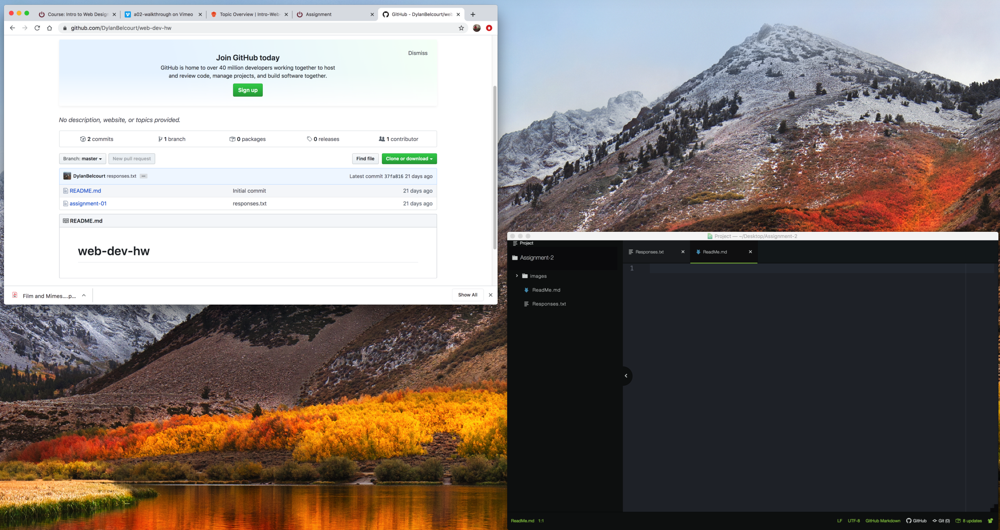

# Assignment-2
## Dylan Belcourt

I decided to take this because I think that this is a good skill to have and understand. I would like to learn how it all works and be able to apply it to something. In todays age we see the top layer of the works every time we open our computer and I would like to be able to create my own version.

What iv'e learned and what to learn
 - iv'e learned the backstage operations of how that data is transferred.
 - also it is a lot simpler than i originally anticipated.
 - I'd like to eventually learn how to us css.

 [Post Falls Auto Auction](https://postfallsautoauction.com/)

 [Responses](./Responses.txt)

 
